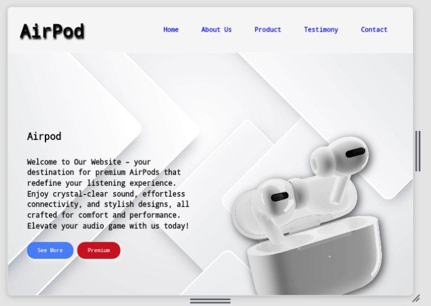

# Responsive Landing Page

## Overview

This project is a responsive landing page developed as part of my internship at Prodigy Infotech. The landing page is designed to provide an engaging user experience across various devices, utilizing modern web technologies.

## Table of Contents

- [Technologies Used](#technologies-used)
- [Features](#features)
- [Project Overview ](#project_overview)
- [Acknowledgements](#acknowledgements)

## Technologies Used

- **HTML**: For structuring the content of the landing page.
- **CSS**: For styling and layout, ensuring the page is visually appealing and responsive.
- **JavaScript**: To add interactivity, specifically for toggling the menu bar on smaller screens.

## Features

- Fully responsive design that adapts to different screen sizes (desktop, tablet, mobile).
- Toggleable menu bar for easy navigation on mobile devices.
- Clean and modern UI with a focus on user experience.
- Semantic HTML for better accessibility and SEO.

## project Preview

## Acknowledgements

- Special thanks to #ProdigyInfoTech for providing me with the opportunity to work on this project during my internship.
- Inspiration from various responsive design examples and tutorials online.

